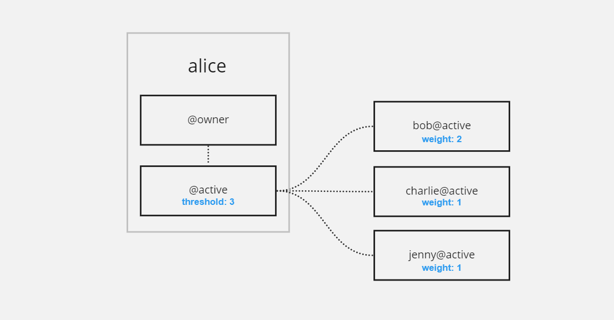

An account on the EOS Network is a digital container that holds a variety of information like EOS tokens that the account owns, resources at its disposal, account control permission structure, and various other things we will get into later in this guide. Accounts can also hold a smart contract. 

An account is the key component that enables you to access and control your blockchain data, as well as execute transactions.


## Account names

Every account on the EOS Network has a human-readable name. This makes it easier to identify transaction recipients and smart contracts. In order to keep account names efficient on the blockchain, a few restrictions apply to all names: 


* All characters must be lowercase
* Every name must be 12 characters long (or less with a suffix/premium name)
* Only letters `a-z`, numbers `1-5`, and period (`.`) are supported characters. 
* Names cannot start with a number or a period. 
* Names cannot end with a period.

Periods have a special meaning for EOS accounts. They specify that an account has a **suffix** (similar to a top-level domain like .com), also known as a **premium name**. Accounts with a suffix can only be created by the **suffix owner**. 

For instance, if someone owns the suffix `.bar` then only that person can create `foo.bar`. 

At the end of this guide, we will talk about the Name Bidding system which allows someone on the EOS network to purchase premium names. 


## Public/Private Keys

Every EOS account is ultimately controlled by a public/private key pair. The private key is used to sign transactions and must be kept confidential, while the public key is used to identify the account on the blockchain and can be publicly known.

It is important to safeguard your private key, as it provides complete control over your account's digital assets. Your private key should be stored in a secure software or hardware wallet, as whoever possesses it will have full access to the assets linked to your account.

EOS accounts offer extra security mechanisms out of the box, using something called the *permission system*.

Examples of private and public keys: 
```
Private: 5KSdyAiFzYQAtBKDBKCCF28KMMhZ4EmXUxSg8B3nSkHKutT15rY
Public: PUB_K1_5d7eRKgCCiEdsbBdxxnZdFWnGYS64uWZPZgTcTU1xnB2aESxqR
Legacy Public Format: EOS5d7eRKgCCiEdsbBdxxnZdFWnGYS64uWZPZgTcTU1xnB2cq4JMD
```


## Permissions system

Each account has a set of hierarchical permissions that control what that account can do, and comes with two base permissions by default. These two permissions cannot be removed as they are required for your account to function properly. 

The mandatory permissions are `owner` and `active`.

A permission can only ever change what controls it (keys or accounts) or the what controls its children. It can never change what controls its parent.


What controls a permission is either a public key (which is registered on chain, and controlled by the associated private key) or another `account@permission`. This allows for the creation of complex account control structures, where multiple parties have control over a single account while still having full autonomy over their own account’s security. 

Take the following diagram as an example, where the account `alice` is controlled both by `bob` and `charlie`, while `charlie` is also controlled by `tom`. Eventually, all accounts are controlled by keys. 


You can add custom permissions underneath `active` which allows you to limit that permission’s access to only a specific contract’s action (callable function). That permission will then only ever be able to interact with the contract action you specified. 

This means you are able to create granular access permissions across accounts and have hierarchical ownership and usage of them. 


Most importantly, the permission system has built-in support for multi-signature transactions (transactions that require multiple parties to sign them). Every linked account or key associated with a permission has a **weight** assigned to it, and the permission itself has a **threshold**. 

As you can see in the example below, `bob` alone does not have enough power to sign using the `active` permission. He needs either `charlie` or `jenny` to co-sign with him for any transaction that `alice@active` makes. On the other hand, `charlie` and `jenny` cannot sign a transaction alone, they need `bob`. 





## Smart Contracts

A smart contract is just a program that runs on the blockchain. It allows you to add functionality to an account ranging from simple things like a todo application to a fully-fledged RPG game running entirely on the blockchain. 

Every account has the ability to have one single smart contract deployed to it, however, that smart contract can be updated and replaced at will. 

For more information about deploying smart contracts to your accounts, please see our [DUNE Guide](./10_dune-guide.md). 


## Creating an Account with DUNE

Once you have **DUNE** set up you can start creating accounts on your local development environment with a single command. 

```shell
dune --create-account <ACCOUNT_NAME>
```

If you want to see the information related to the account you just created, you can use the following command. 

```shell
dune -- cleos get account <ACCOUNT_NAME>
```


## Ownership of Digital Assets

Data that can be owned by an account, and is stored on the blockchain, is commonly referred to as a "digital asset". **Ownership** of these digital assets simply means that a row in the decentralized database (blockchain) says that the asset belongs to a specific account, and that only that account has the ability to manipulate, transfer, or otherwise control that digital asset. 

Keep in mind that a smart contract also co-owns that digital asset with the account, and might be able to manipulate all assets that are stored inside of its tables without the explicit consent of the user.

Smart contract developers may also update smart contracts at will, so contracts that have security or financial implications may relinquish their ability to update their smart contracts in order to trade upgradeability for increased user trust. 


## Relinquishing ownership of an account

Upgradeability has significant benefits for smart contract development, but isn’t always wanted. 

In order to relinquish a smart contract’s upgradeability, you have two options.


### NULL account

You may set the contract account’s owner and active permissions to `eosio.null@active`. This is a `NULL` account that is specifically designed for these purposes. It has no private key or owner. 

This is a good option if you want to relinquish control of this account **forever**.


```
dune -- cleos set account permission <ACCOUNT> active '{"threshold":1,"keys":[],"accounts":[{"permission":{"actor":"eosio.null","permission":"active"},"weight":1},{"permission":{"actor":"<ACCOUNT>","permission":"eosio.code"},"weight":1}],"waits":[]}' owner -p <ACCOUNT>
dune -- cleos set account permission <ACCOUNT> owner '{"threshold": 1, "keys":[], "accounts":[{"permission":{"actor":"eosio.null","permission":"active"},"weight":1}], "waits":[] }' -p <ACCOUNT>@owner
```

(note the `eosio.code` addition for the `active` permission, which you might need if the account is a smart contract!)

### Prods accounts

Alternatively, you may set the contract account’s `owner` and `active` permissions to three different types of producer-controlled (network consensus-controlled) accounts, so that if there is ever an issue with this contract you can request the help of the producers to upgrade the contract. 

This is a good option if you are dealing with intricate and complex contracts that might have bugs that could impact the users negatively. 

#### eosio.prods

The `eosio.prods` account is controlled by ⅔+1 of the actively producing producers on the network. This means that if there are 21 active producers then you would need 15 of them to sign off on all upgrades. 

```
dune -- cleos set account permission <ACCOUNT> active '{"threshold":1,"keys":[],"accounts":[{"permission":{"actor":"eosio.prods","permission":"active"},"weight":1},{"permission":{"actor":"<ACCOUNT>","permission":"eosio.code"},"weight":1}],"waits":[]}' owner -p <ACCOUNT>
dune -- cleos set account permission <ACCOUNT> owner '{"threshold": 1, "keys":[], "accounts":[{"permission":{"actor":"eosio.prods","permission":"active"},"weight":1}], "waits":[] }' -p <ACCOUNT>@owner
```


#### prod.major

The `prod.major` account is controlled by ½+1, meaning that if there are 30 active producers then you would need 16 of them to sign off on all upgrades.


```
dune -- cleos set account permission <ACCOUNT> active '{"threshold":1,"keys":[],"accounts":[{"permission":{"actor":"prod.major","permission":"active"},"weight":1},{"permission":{"actor":"<ACCOUNT>","permission":"eosio.code"},"weight":1}],"waits":[]}' owner -p <ACCOUNT>
dune -- cleos set account permission <ACCOUNT> owner '{"threshold": 1, "keys":[], "accounts":[{"permission":{"actor":"prod.major","permission":"active"},"weight":1}], "waits":[] }' -p <ACCOUNT>@owner
```

#### prod.minor

The `prod.minor` account is controlled by ⅓+1, meaning that if there are 30 active producers, then you would need 11 of them to sign off on all upgrades.


```
dune -- cleos set account permission <ACCOUNT> active '{"threshold":1,"keys":[],"accounts":[{"permission":{"actor":"prod.minor","permission":"active"},"weight":1},{"permission":{"actor":"<ACCOUNT>","permission":"eosio.code"},"weight":1}],"waits":[]}' owner -p <ACCOUNT>
dune -- cleos set account permission <ACCOUNT> owner '{"threshold": 1, "keys":[], "accounts":[{"permission":{"actor":"prod.minor","permission":"active"},"weight":1}], "waits":[] }' -p <ACCOUNT>@owner
```

## Account creation costs

Because EOS accounts have multiple things registered to them, like their permissions, as well as the resources (CPU, NET, RAM) they hold, there is a cost incurred when creating them on the network. This also means that someone who already has an account needs to create an account for you. There are many services that do this for the EOS network, and for your local development environment you can create accounts using the system account (`eosio`). 

This does however potentially impact your application design, as your users who aren't already on the network will need accounts created for them. You should take this cost into consideration when planning your user acquisition expenses. 

The cost of opening an account is based on the RAM required for opening it, which as of writing this document (20/02/2023) is `2996 bytes`.

Go to our [Resources Guide](./30_resources.md) to learn how to calculate the cost of purchasing RAM from the RAM Market.

## Bidding on premium names (suffixes)

In order to own a premium name (for example: `foo[.bar]`) you must bid on it and then win it in an auction. 

You must also: 

* Have the highest bid across **all** names being bid on at that point in time – meaning if there are multiple people bidding on multiple different names, the name with the highest overall bid will be won first, and the next name with the highest bid on it will be won 24 hours later.
* Stay as the top bidder for the name you bid on for 24 hours, if someone else bids on the name you are trying to win, the timer will reset and another 24-hour period begins. 
* Bid 10% higher than the last bid – If you are outbid on a name, you will receive your bid back. If a name never gets outbid or awarded, **your funds will not be returned to you**. 

In order to bid on a name on the EOS Network you can head over to [EOS Authority](https://eosauthority.com/bidname) where you can see all of the bids live on the chain, including the histories of everyone who has bid on names that are currently in the queue. 

If you want to create a premium named account and have **not** boostrapped your local DUNE node, you can do:
```
dune --create-account test.acc
```

Otherwise, you will have to go through the name bid process on your local as well: 
```
dune -- cleos system bidname <BIDDER> <NAME> <BID>
```

To see information about your local bid:
```
dune -- cleos system bidnameinfo <NAME>
```

