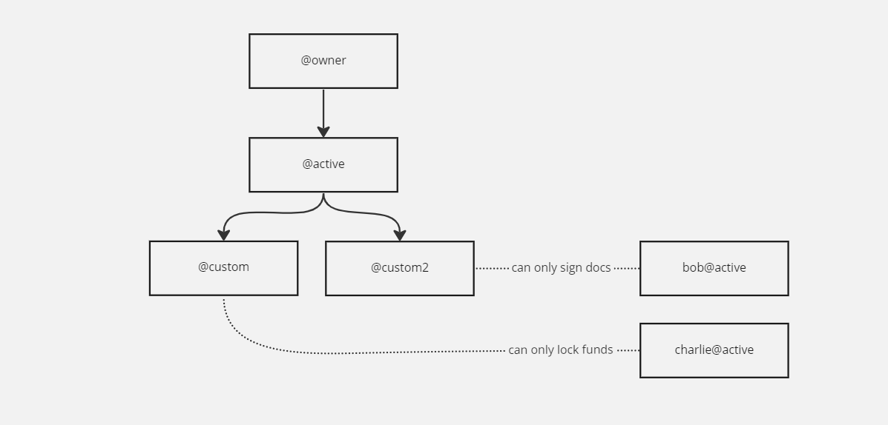

## What is an account?

On the EOS Network an account is a digital container. The digital container holds a variety of information such as EOS tokens the account owns, resources at its disposal, an account control permission structure, and more. Accounts can also hold a smart contract. An account is the key component that enables access and control of your blockchain data and to execute transactions.


## Account Names

Every account on the EOS Network has a human-readable name. A human-readable name facilitates the identity of transaction recipients and smart contracts. 

### Account Naming Convention

The following restrictions apply to all account names on the EOS blockchain:

* All characters must be lowercase.
* Every name must be 12 characters long (or less with a suffix/premium name).
* Only letters `a-z`, numbers `1-5`, and period (`.`) are supported characters. 
* Names cannot start with a number or a period. 
* Names cannot end with a period.

Periods have a special meaning for EOS accounts. They specify that an account has a **suffix** (similar to a top-level domain like .com), also known as a **premium name**. Accounts with a suffix can only be created by the **suffix owner**. 

For example, if someone owns the suffix `.bar` then only that person can create `foo.bar`. 

More information is availble about the Name Bidding System later in this guide, which allows you to purchase premium names on the EOS network.


## Public/Private Keys

Every EOS account is controlled by a public/private key pair. Use the private key to sign transactions and it must be kept confidential. Use the public key to identify the account on the blockchain and it can be publicly known.

Safeguard your private key, as it provides complete control over your account's digital assets. Your private key should be stored in a secure software or hardware wallet. Whoever possesses it has full access to the assets linked to your account.

EOS accounts offer extra security mechanisms out of the box and use the *permission system*.

Examples of private and public keys: 
```
Private: 5KSdyAiFzYQAtBKDBKCCF28KMMhZ4EmXUxSg8B3nSkHKutT15rY
Public: PUB_K1_5d7eRKgCCiEdsbBdxxnZdFWnGYS64uWZPZgTcTU1xnB2aESxqR
Legacy Public Format: EOS5d7eRKgCCiEdsbBdxxnZdFWnGYS64uWZPZgTcTU1xnB2cq4JMD
```


## Permissions System

Each account has a set of hierarchical permissions that control what that account can do. Hierarchical permissions have two base permissions by default. These two permissions are required for your account to function properly and cannot be removed. 

The mandatory required permissions are `owner` and `active`.

A permission can only change what controls it (keys or accounts) or what controls its children. It can not change what controls its parent.


What controls a permission is either a public key (which is registered on chain, and controlled by the associated private key) or another `account@permission`. This control allows for the creation of complex account control structures, where multiple parties have control over a single account while still having full autonomy over their own account’s security. 

Take the following diagram as an example, where the account `alice` is controlled both by `bob` and `charlie`, while `charlie` is also controlled by `tom`. Eventually, all accounts are controlled by keys. 


You can add custom permissions under `active` which allow you to limit that permission’s access to only a specific contract’s action (callable function). That permission will only be able to interact with the contract action you specified. 

Therefore you are able to create granular access permissions across accounts and have hierarchical ownership and usage of them. 





The permission system has built-in support for multi-signature transactions (transactions that require multiple parties to sign them). Every linked account or key associated with a permission has a **weight** assigned to it, and the permission itself has a **threshold**. 

In the example below, `bob` alone does not have enough power to sign using the `active` permission. He needs either `charlie` or `jenny` to co-sign with him for any transaction that `alice@active` makes. `charlie` and `jenny` cannot sign a transaction alone, they need `bob`. 


## Smart Contracts

A smart contract is a program that runs on the blockchain. It allows you to add functionality to an account ranging from simple features like a todo application to a fully-fledged RPG game running entirely on the blockchain. 

Every account has the ability to have one single smart contract deployed to it. The smart contract can be updated and replaced at will. 

For more information about deploying smart contracts to your accounts, please see our [DUNE Guide](../10_dune-guide/index.md). 


## Creating an Account with DUNE

Once you have **DUNE** set up, you can start creating accounts on your local development environment with a single command. 

```shell
dune --create-account <ACCOUNT_NAME>
```

If you want to see the information related to the account you just created, use the following command. 

```shell
dune -- cleos get account <ACCOUNT_NAME>
```


## Ownership of Digital Assets

Data, owned by an account and stored on the blockchain, is commonly referred to as a "digital asset". **Ownership** digital assets indicates that a row in the decentralized database (blockchain) belongs to a specific account. Only the **ownership** account has the ability to manipulate, transfer, or otherwise control that digital asset. 

A smart contract co-owns a digital asset with its account. A co-owning smart contract may be able to manipulate all assets stored inside its tables without the explicit consent of the user.

Smart contract developers may also update smart contracts at will. Therefore smart contracts that have security or financial implications may relinquish their ability to update their smart contracts to trade upgradeability for increased user trust. 


## Relinquishing Ownership of an Account

Upgradeability has significant benefits for smart contract development, but is not always desired. 

To relinquish a smart contract’s upgradeability, you have two options - null and prod accounts.


### NULL account

A `NULL` account has no private key or owner. A `NULL` account is a good option if you want to relinquish control of this account **forever**.
Set the contract account’s owner and active permissions to `eosio.null@active`. 


```
dune -- cleos set account permission <ACCOUNT> active '{"threshold":1,"keys":[],"accounts":[{"permission":{"actor":"eosio.null","permission":"active"},"weight":1},{"permission":{"actor":"<ACCOUNT>","permission":"eosio.code"},"weight":1}],"waits":[]}' owner -p <ACCOUNT>
dune -- cleos set account permission <ACCOUNT> owner '{"threshold": 1, "keys":[], "accounts":[{"permission":{"actor":"eosio.null","permission":"active"},"weight":1}], "waits":[] }' -p <ACCOUNT>@owner
```

(note the `eosio.code` addition for the `active` permission, which you might need if the account is a smart contract!)

### Prods Accounts

A prods account permits you to set the smart contract account's `owner` and `active` permissions to the three following three different types of producer-controlled (network consensus-controlled) accounts. Therefore, you can request help from the producers to upgrade the smart contract if there is an issue with the smart contract. A producer-controlled account is a good option if you are dealing with intricate and complex contracts that might have bugs that could impact the users negatively.

#### eosio.prods

The `eosio.prods` account is controlled by ⅔+1 of the actively producing producers on the network. Therefore, if there are 21 active producers then you would need 15 of them to sign off on all upgrades. 

```
dune -- cleos set account permission <ACCOUNT> active '{"threshold":1,"keys":[],"accounts":[{"permission":{"actor":"eosio.prods","permission":"active"},"weight":1},{"permission":{"actor":"<ACCOUNT>","permission":"eosio.code"},"weight":1}],"waits":[]}' owner -p <ACCOUNT>
dune -- cleos set account permission <ACCOUNT> owner '{"threshold": 1, "keys":[], "accounts":[{"permission":{"actor":"eosio.prods","permission":"active"},"weight":1}], "waits":[] }' -p <ACCOUNT>@owner
```


#### prod.major

The `prod.major` account is controlled by ½+1, meaning that if there are 30 active producers then you would need 16 of them to sign off on all upgrades.


```
dune -- cleos set account permission <ACCOUNT> active '{"threshold":1,"keys":[],"accounts":[{"permission":{"actor":"prod.major","permission":"active"},"weight":1},{"permission":{"actor":"<ACCOUNT>","permission":"eosio.code"},"weight":1}],"waits":[]}' owner -p <ACCOUNT>
dune -- cleos set account permission <ACCOUNT> owner '{"threshold": 1, "keys":[], "accounts":[{"permission":{"actor":"prod.major","permission":"active"},"weight":1}], "waits":[] }' -p <ACCOUNT>@owner
```

#### prod.minor

The `prod.minor` account is controlled by ⅓+1, meaning that if there are 30 active producers, then you would need 11 of them to sign off on all upgrades.


```
dune -- cleos set account permission <ACCOUNT> active '{"threshold":1,"keys":[],"accounts":[{"permission":{"actor":"prod.minor","permission":"active"},"weight":1},{"permission":{"actor":"<ACCOUNT>","permission":"eosio.code"},"weight":1}],"waits":[]}' owner -p <ACCOUNT>
dune -- cleos set account permission <ACCOUNT> owner '{"threshold": 1, "keys":[], "accounts":[{"permission":{"actor":"prod.minor","permission":"active"},"weight":1}], "waits":[] }' -p <ACCOUNT>@owner
```

## Account Creation Costs

EOS accounts have multiple qualities registered to them, such as their permissions and the resources (CPU, NET, RAM) they hold. Therefore, costs are incurred when creating an EOS account on the network. Someone who already has an account needs to create an account for you. Many services are available to create accounts for the EOS network and for your local development environment. You can create accounts using the system account (`eosio`).

Your users who aren't already on the network will need accounts created for them. You need to take this cost into consideration when planning your user acquisition expenses.

The cost of opening an account is based on the RAM required for opening it, which as 20/02/2023 is `2996 bytes`.

Go to our [Resources Guide](../30_resources/index.md) to learn how to calculate the cost of purchasing RAM from the RAM Market.

## Bidding on premium names (suffixes)

In order to own a premium name (for example: `foo[.bar]`) you must bid on it and then win it in an auction. 

You must also: 

* Have the highest bid across **all** names being bid on at that point in time – meaning if there are multiple people bidding on multiple different names, the name with the highest overall bid will be won first, and the next name with the highest bid on it will be won 24 hours later.
* Stay as the top bidder for the name you bid on for 24 hours, if someone else bids on the name you are trying to win, the timer will reset and another 24-hour period begins. 
* Bid 10% higher than the last bid – If you are outbid on a name, you will receive your bid back. If a name never gets outbid or awarded, **your funds will not be returned to you**. 

In order to bid on a name on the EOS Network you can head over to [EOS Authority](https://eosauthority.com/bidname) where you can see all of the bids live on the chain, including the histories of everyone who has bid on names that are currently in the queue. 

If you want to create a premium named account and have **not** boostrapped your local DUNE node, you can do:
```
dune --create-account test.acc
```

Otherwise, you will have to go through the name bid process on your local as well: 
```
dune -- cleos system bidname <BIDDER> <NAME> <BID>
```

To see information about your local bid:
```
dune -- cleos system bidnameinfo <NAME>
```

