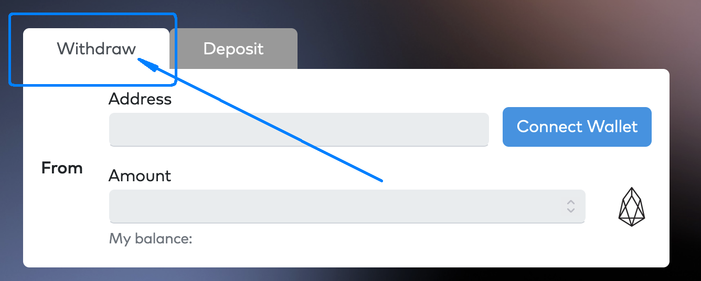
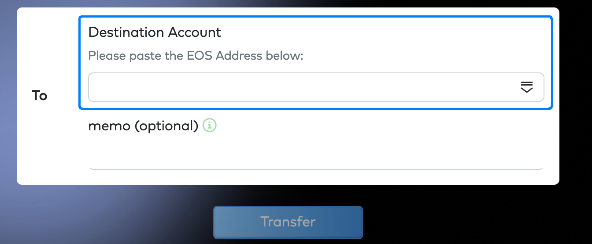
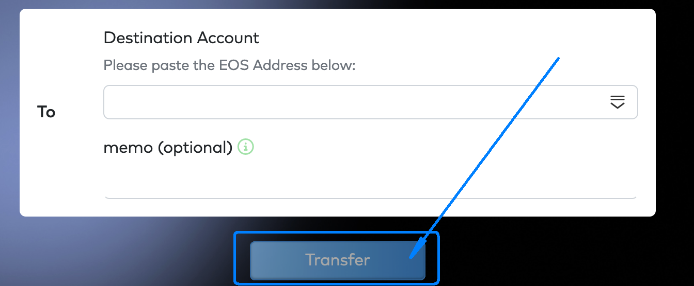

## Motivation

Some exchanges do not yet support tracking inline transfer on EOS, which prevents them from seeing EOS EVM transfers. This does not mean you do not have the ability to use those exchanges. You just need to take a few extra steps yourself to make sure your funds are safe.

## Prerequisites

This guide assumes you are familiar with EOS wallets and with the process of transferring EOS tokens between EOS accounts on mainnet or testnet.

## Steps

To transfer EOS tokens from an EOS EVM address to an exchange address/account, using the EOS EVM bridge, follow these steps:

1. Go to the [EOS EVM bridge](https://bridge.evm.eosnetwork.com/).
2. Click on the `Connect Wallet` button and connect your preferred wallet (e.g. Metamask).
\

3. Make sure your wallet has now active the EOS EVM mainnet.
4. Back on the EOS EVM bridge, make sure the `Withdraw` tab is the active one, if not, click on it to activate it.
\

5. On the `From` panel, the `Address` field should now contain your EOS EVM address.
\

6. On the `From` panel, enter in the `Amount` field, the amount of EOS tokens you want to transfer to EOS mainnet.
\

7. On the `To` panel, in the `Destination Account` field, enter the EOS mainnet account, you want to transfer the EOS tokens to.
\

8. Click on the `Transfer` button; the preferred wallet you are connect to now activates and presents to you the transfer transaction information.
\

9. Verify all the transaction information presented to you and if you agree click `Confirm` to approve the transaction.
10. In a few seconds, you can verify your EOS mainnet account balance using either an EOS blockchain explorer or an EOS wallet.
11. After the tokens are in the EOS mainnet account you can use an EOS wallet to transfer it to any exchange address/account.
