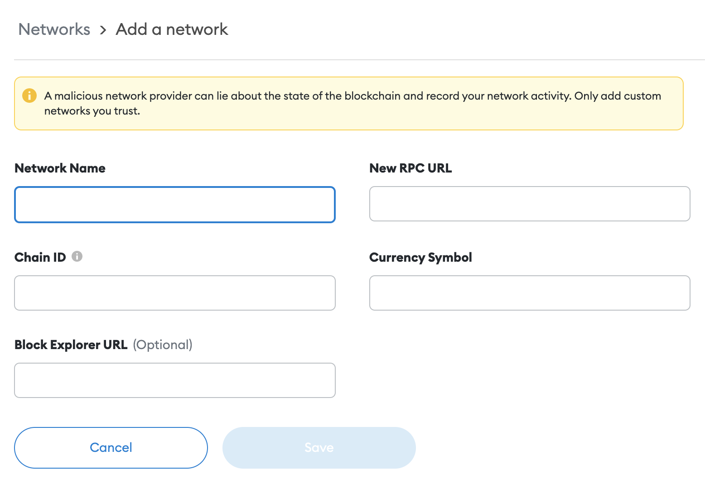

To add the EOS EVM network to your Metamask wallet follow the steps below:

1. Open the Metamask wallet and click on the network in the top center:

2. Click on `Add network` at the end of the dropdown list:

3. Fill in the connection details of the EOS EVM network you want to connect to and click the `Save` button:

The EOS EVM Network Testnet Preview connection details are as follows:

* `Network Name`: EOS EVM Network Testnet
* `Chain ID`: 15556
* `New RPC URL`: https://api-testnet.trust.one/
* `Currency Symbol`: EVM
* `Block Explorer URL (Optional)`: https://explorer-testnet.trust.one/

Alternative endpoints can be found at [resources](30_resources.md) page.

Yet another way is to find the network you want to connect to at [Chainlist.org](https://chainlist.org/), and you can add the configuration to your wallet through that service.
