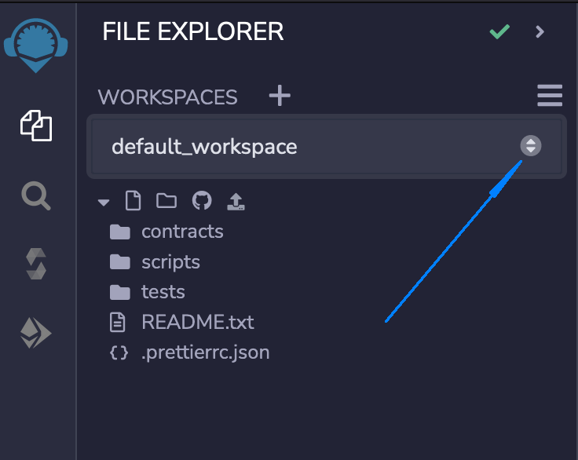
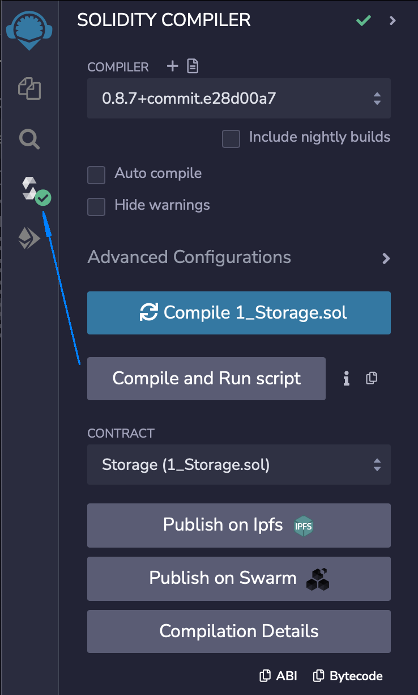
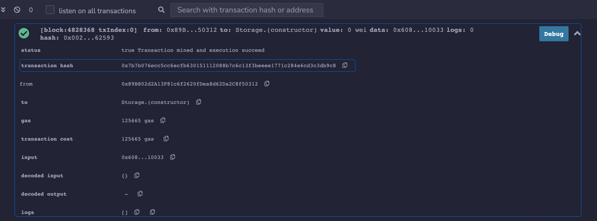
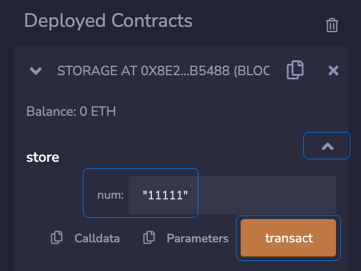
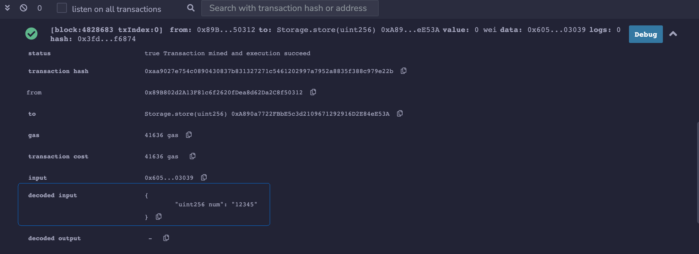

## Remix IDE

Remix IDE is a popular integrated development environment for smart contract development written in Solidity programming language. It is intuitive and very easy to use. Remix can be used by any developer with any level of experience. This document outlines the main steps to develop a smart contract for the EOS EVM network, written in Solidity. The official Remix documentation can be found at [remix-ide.readthedocs.io](https://remix-ide.readthedocs.io/en/latest/).

The Remix IDE comes in three flavors: the web application, the desktop application, and a VSCode extension. This tutorial uses the Remix web IDE. From here onwards the `Remix IDE` refers to the Remix web application integrated development environment.

## Start A Workspace

Navigate to the [Remix IDE web version](https://remix.ethereum.org/). One of the first thing you notice is the `FILE EXPLORER` panel on the left side of the screen. You can see that the Remix IDE already created a default workspace with three folders:

- `Contracts`,
- `Scripts`,
- `Tests`

and a `README.txt` file.

You can read the `README.txt` file for details about what each folder purpose is.

## Write A Smart Contract

Next create a new solidity file where to code the smart contract. Conventionally, a solidity file has the `.sol` extension. Right-click on the `contracts` folder and select `New File` menu option, chose a name for your file, and then write the solidity code, which defines the smart contract. As an alternative you can use one of the samples solidity files provided by the Remix IDE.

For simplicity this tutorial uses the existing `1_Storage.sol` sample smart contract.

## Compile The Smart Contract

To compile the `Storage` sample smart contract, right click on the `1_Storage.sol` file and chose `Compile` menu option.

The compilation for this smart contract is instant and, if successful, you will notice a green mark on the solidity compiler switch button on the right side of screen. Click on that button to open the `SOLIDITY COMPILER` panel.

#### Solidity Compiler Panel

If the compilation fails you will notice a red icon instead of the green one. If you click on it you will find details about the compilation errors on the `Solidity Compiler` panel.

You will return to this panel later, after you deploy the smart contract, and also if you want to [verify](#verify-the-smart-contract) the deployed smart contract.

## Connect To EOS EVM

### Connect MetaMask Wallet

To connect the Remix IDE to the EOS EVM network you must first [connect your metamask wallet](./10_connect-metamask.md) to the EOS EVM network. You can connect to the EOS EVM main network or you can connect to any of the available EOS EVM test networks. For information about available EOS EVM networks please consult the [helpful links](../60_helpful_links.md) section.

### Have Enough EOS Tokens

You also must ensure you have EOS tokens available in your wallet to be able to cover the transactions costs.

If you use the EOS EVM main network:

- you can transfer tokens from a different address,
- or you can use the [EOS EVM bridge](https://bridge.evm.eosnetwork.com/) to transfer EOS tokens from the EOS mainnet address.

If you use the EOS EVM test network you can use the [faucet](https://faucet.testnet.evm.eosnetwork.com) to get some EOS tokens.

### Connect the Remix IDE To EOS EVM

To connect the Remix IDE to the EOS EVM network:

1. Click the `Deploy & run transactions` button on the left side vertical menu to switch to the `Deploy & run transactions` panel.
2. Click the `ENVIRONMENT` drop-down list.
3. Select from the `Injected Provider - MetaMask` option.

\

Right after you successfully selected `Injected Provider - MetaMask` option from the drop-down list, the `ACCOUNT` field gets populated with your wallet address. Make note of it and make sure it is indeed the same address as your MetaMask wallet.

## Deploy The Smart Contract

1. Make sure the `CONTRACT (Compiled by Remix)` field shows the value `Storage/contracts - 1_Storage.sol`. If not, click on the drop-down list and select it.
2. Click Deploy button
3. Confirm the transaction on the MetaMask wallet
4. Wait for the transaction to complete on the blockchain

When the transaction is done you will see details in the bottom panel. Notice the status of the transaction and the transaction hash. You can open the [blockchain explorer](https://explorer.evm.eosnetwork.com/) and search for the transaction hash to see it on chain.

## Execute Actions

As soon as the smart contract is deployed to the blockchain, that is, the transaction is confirmed on the blockchain, you can interact with the smart contract through the Remix `DEPLOY & RUN TRANSACTIONS` panel.

At the bottom of the panel you can see the `Deployed Contracts` section which lists all deployed smart contracts in the current Remix session. You should see one smart contract 'STORAGE' followed by the blockchain address where the smart contract was deployed at. Click the small button at the left side of the contract name to expand the panel and see its details. At the top of the details panel you can see the balance of your smart contract address and then below the list of actions your smart contract implements. In this case you can see two actions: `store` and `retrieve`.

To send an instance of the `store` action to your smart contract you first set the value for its `num` parameter which is of type `uint256` and then click the `store` button. If the action has multiple params you have to expand the list of the parameters to see them all, provide values for each of them and then click the `transact` button.

The click on the `store` or on the `transact` button opens up the MetaMask wallet with the transaction you are about to send to the blockchain. This transaction packs the `store` action with the parameter you typed. Go ahead and click on the `Confirm` MetaMask button to sign the transaction and send it to the blockchain.

Wait for the transaction to be confirmed on the blockchain and note on the Remix log panel, on the bottom of the screen, the status of the transaction, the transaction hash, and the decoded input parameter value.

Search for the transaction hash on the [blockchain explorer](https://explorer.evm.eosnetwork.com/). Note that the input parameter is not decoded. In order to see it decoded you must verify your smart contract on chain.

## Verify The Smart Contract

To verify the smart contract you need to identify four properties of the smart contract and then follow the steps outlined in the [how to verify a smart contract](./60_how_to_verify_a_smart_contract.md) document.

To verify your smart contract you need to know the following:

- The smart contract address; you will find the smart contract address in the [`DEPLOY & RUN TRANSACTIONS`](#execute-actions) panel.

- The compiler version used to compile the smart contract; you will find the compiler version on the [`SOLIDITY COMPILER`](#solidity-compiler-panel) panel.

- The EVM version for which the WASM was compiled for; to find the version go to the [`SOLIDITY COMPILER`](#solidity-compiler-panel) panel, click on the `Compilation Details` button at the bottom of the panel, and then navigate to the `METADATA -> Settings -> evmVersion`.

- The solidity flattened sources file for your smart contract; to produce the flattened source file navigate to the [`FILE EXPLORER`](#start-a-workspace) panel, right click on the `1_Storage.sol` file and select from the the `Flatten` option from the opened floating menu.

With all the above information you can now follow the steps outline in the [how to verify a smart contract](./60_how_to_verify_a_smart_contract.md) document to get the job done.
