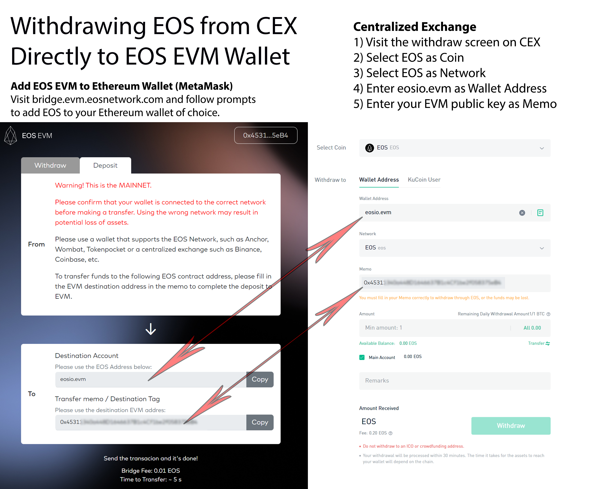

To withdraw EOS tokens from a centralize exchange (CEX) to an EOS EVM address:

1. Make sure you connect your wallet of choice to EOS EVM mainnet. See [how to connect MetaMask](./10_connect-metamask.md) documentation.
2. Visit the withdraw screen of the CEX website or app.
3. Select EOS as Coin.
4. Select EOS as Network.
5. Enter `eosio.evm` as Wallet Address.
6. Enter your EOS EVM public key as Memo.

See below for an example that shows how each field maps from CEX to the EOS Bridge and vice-versa.

