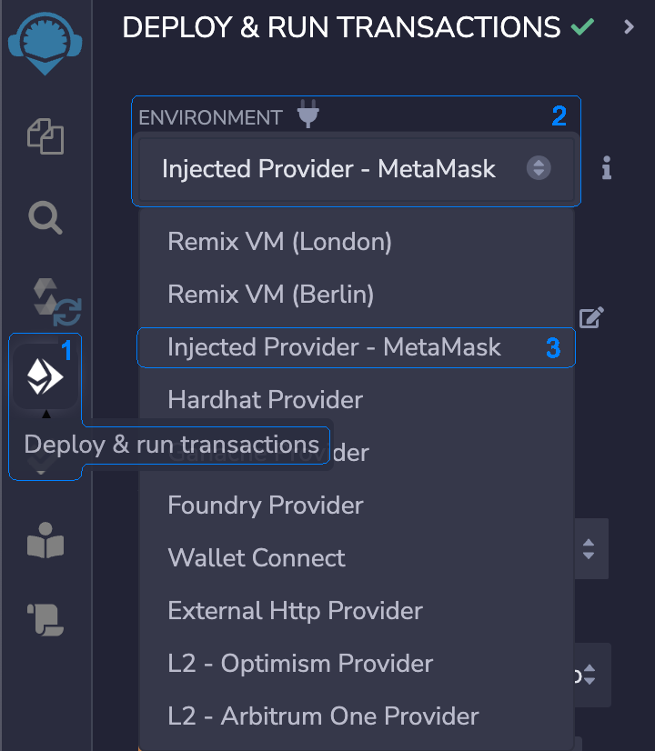

The [Remix IDE](https://remix.ethereum.org/) is a popular integrated development environment for smart contract 
development written in Solidity programming language. Remix can be used by any developer with any level of experience. 
 
If you want to learn more about Remix, you can visit their [official documentation.](https://remix-ide.readthedocs.io/en/latest/)

## Prerequisites

If you haven't already, you'll need to [connect your metamask wallet](../../10_basic-setup/10_connect-metamask.md) to the 
EOS EVM mainnet or testnet. 

You will also need EOS tokens on that network. If you are on the testnet you can head over to the [faucet](https://faucet.testnet.evm.eosnetwork.com)
to get some, and if you are on the mainnet you can use the [EOS EVM bridge](https://bridge.evm.eosnetwork.com/) to transfer
EOS tokens from the native chain to the EVM.

### Connect the Remix IDE To EOS EVM

To connect the Remix IDE to the EOS EVM network:

1. Click the `Deploy & run transactions` button on the left side vertical menu to switch to the `Deploy & run transactions` panel.
2. Click the `ENVIRONMENT` drop-down list.
3. Select from the `Injected Provider - MetaMask` option.

Right after you successfully selected `Injected Provider - MetaMask` option from the drop-down list, the `ACCOUNT` field 
gets populated with your wallet address. Make note of it and make sure it is indeed the same address as your 
MetaMask wallet.
