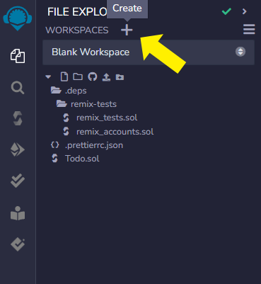
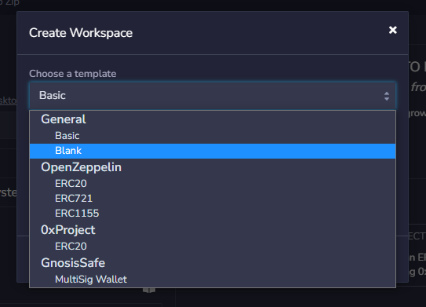
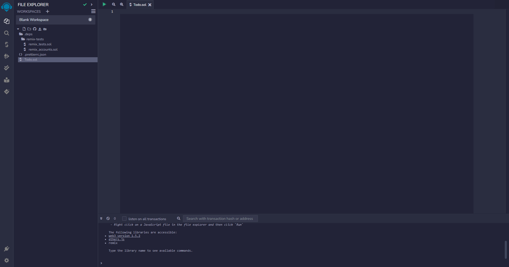
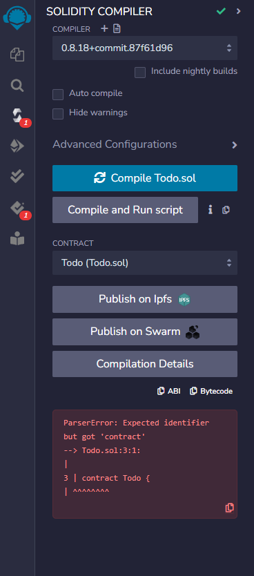
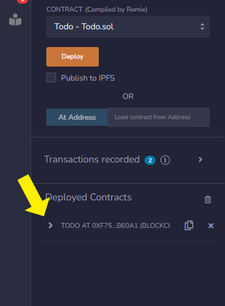
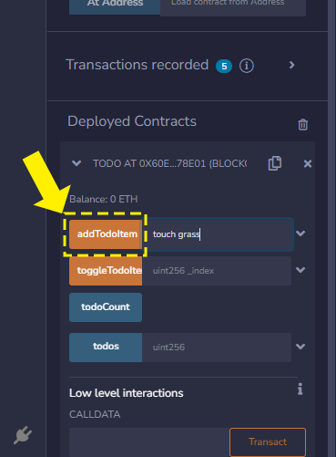
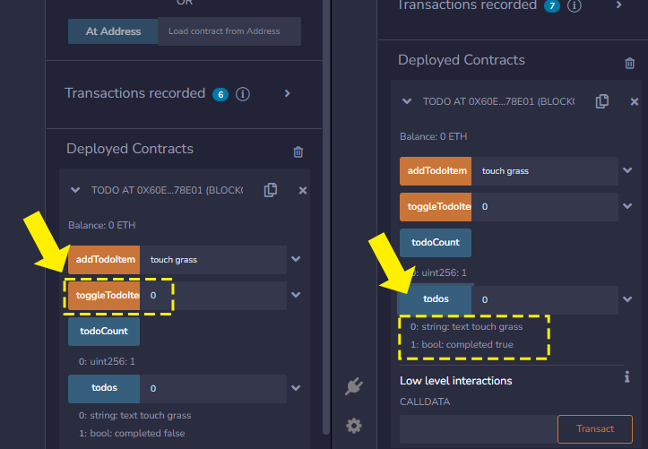

Remix is a web-based IDE that allows you to write, compile, and deploy smart contracts to the EOS EVM.

## Learning the interface

Head over to [Remix](https://remix.ethereum.org/) and you should see the following:


The Remix interface can be broken down into 2 main sections:

1. **Sidebar** - This panel changes depending on what icon you click on.
   - **File explorer** - This is where you can create, open, and save files.
   - **Search** - This is where you can search in your files.
   - **Solidity Compiler** - This is where you can compile your smart contract.
   - **Deploy & Run Transactions** - This is where you can deploy and interact with your smart contract.
   - **Solidity Unit Testing** - This is where you can run unit tests for your smart contract.
2. **Editor** - This is where you can write your smart contract code.
3. **Terminal** - This is where you will see outputs from different actions like compiling, deploying, and running tests.


## Workspaces

Remix has a concept of workspaces, which are essentially a collection of files that you can save and open together.

You can create a new workspace by clicking on the `+` icon in the sidebar next to `WORKSPACES`



In the popup, select `Blank` from the template drow-down, give your workspace a name, and click `OK`.



Now that you have an empty workspace, create a new file for the contract we will be working on.

Click on the blank page icon in the sidebar and name the file `Todo.sol`.


You now have a new workspace with a single file called `Todo.sol`, and you're ready to start writing your smart contract.



## Writing your smart contract

Let's start by writing a simple smart contract that will allow us to create a todo list, and check items off our todo list.

Copy and paste the following code into your `Todo.sol` file:

```solidity
pragma solidity ^0.8.0;

contract Todo {
    struct TodoItem {
        string text;
        bool completed;
    }
   
    TodoItem[] public todos;
    uint256 public todoCount;
   
    function addTodoItem(string memory _text) external {
        todos.push(TodoItem(_text, false));
        todoCount++;
    }
   
    function toggleTodoItem(uint _index) external {
        todos[_index].completed = !todos[_index].completed;
    }
}
```

## Breaking down the contract

Let's briefly go over what this contract does, and how it works.

### Defining the compiler version

In Solidity, the first thing you need to do is define the compiler version you want to use.

```solidity
pragma solidity ^0.8.0;
```

In our case we are using version `0.8.0` of the Solidity compiler, and allowing it to use any patch version of `0.8` by 
prefixing the version with `^`.

### Defining a struct

Structs are a way to define a custom data type. In our case we are defining a `TodoItem` struct that has 2 properties:

- `text` - A string that will hold the text of the todo item
- `completed` - A boolean that will hold whether the todo item is completed or not

### Defining state variables

State variables are variables that are stored on the blockchain. They exist in the root scope of the contract.

In our contract, we defined two state variables:

- `todos` - An array of `TodoItem` structs
- `todoCount` - A number that will keep track of how many todo items we have

### Defining a function

Functions are a way to encapsulate logic that can be called from outside the contract, or from within the contract.

We only need functions that can be called from **outside** the contract, so we will define our functions as `external`.

> ❔ **Function visibility types**
> 
> There are 4 different function visibility types: `external`, `public`, `internal`, and `private`.
> We will get into the details of each of these in later guides.

Functions are the main way to interact with a smart contract. They can be called from outside the contract, or from
within the contract.

In our contract, we defined two functions:

- `addTodoItem` - This function takes a string as an argument, and adds a new `TodoItem` to the `todos` array.
- `toggleTodoItem` - This function takes a numerical index as an argument, and toggles the `completed` state of the
  `TodoItem` at that index.

## Compiling your smart contract

Now that we have written our smart contract, we need to compile it so that we can deploy it to the EOS EVM.

Click on the `Solidity Compiler` icon in the sidebar.

> ❕ **Make sure you have the correct file open**
> 
> Whatever contract you have open will be what it lets you compile, so make sure you have the `Todo.sol` file open.

Now click the `Compile Todo.sol` button.


If your contract has any errors, you will see a red box on the sidebar for each error it finds.



## Deploying your smart contract

Now that we have compiled our smart contract, we can deploy it to the EOS EVM.

Click on the `Deploy & Run Transactions` icon in the sidebar.

Then click on the `ENVIROMENT` dropdown and select `Injected Provider - MetaMask`.

> ❕ **Set up your MetaMask first!**
> 
> If you haven't already, make sure you have set up your MetaMask wallet and connected it to the EOS EVM.
> 
> **You can follow [this guide](/docs/50_eos-evm/10_basic-setup/10_connect-metamask.md) to learn how to do that.**


MetaMask will pop up and ask you to connect an account.


You can now click the `Deploy` button to deploy your smart contract to the EOS EVM.

This will open up a MetaMask popup asking you to confirm the transaction.


If successful, you will see a message in the console, and also a notification from MetaMask.


> 🤕 **Encountering errors?**
> 
> If you encounter any errors, you will get information both from MetaMask and also in the console on Remix.
> Common issues are that you do not have enough balance in your wallet to pay for the transaction, or that you have
> not set up your MetaMask wallet correctly.

## Interacting with your smart contract

Now that we have deployed our smart contract, we can interact with it.

In the `Deploy & Run Transactions` panel, you will see a section called `Deployed Contracts`.

You should see a contract called `TODO` with a little arrow next to it. Click on the arrow to expand the contract.



You will now see a list of all the functions in your contract, as well as any public state variables.

Click the input field next to the `addTodoItem` function, and type in some text. 
Then click the `addTodoItem` button, which will send another transaction to the chain using MetaMask.



To verify that we've added an item to our todo list, you can press the `todoCount` button, which will read the value
of the `todoCount` state variable. It will then show you the result below the button.

You can also fill the `0` index into the `todos` array state variable and press the button to see the contents of the 
`todos` array at that index.

> The index is zero-based, so the first item in the array is at index `0`.


And finally, we can toggle our todo item by filling in the `0` index into the `toggleTodoItem` function, and pressing
the button. You can fetch the todo item like you did before by pressing the `todos` button again, and you should see
that the `completed` property has changed.



## Next steps

**Congratulations!**

You have now successfully deployed and interacted with your first smart contract on the EOS EVM!

You learned about smart contract basics, setting up MetaMask, and using Remix to develop, deploy, and interact with
your smart contract.
