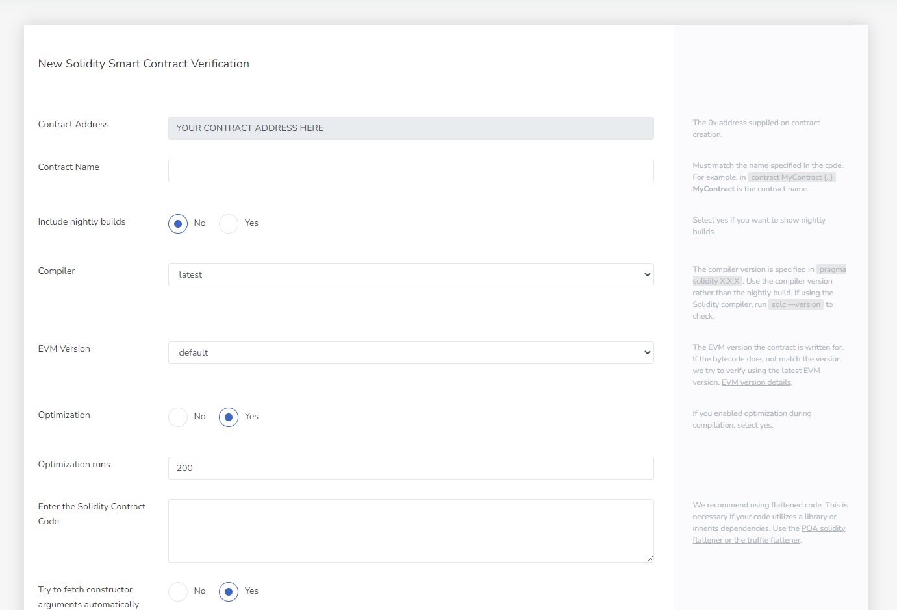

In order to verify your smart contract, you must know your:

- Smart contract address
- The compiler version that the deployed contract was compiled with
- The EVM version
- The solidity flattened source code for your smart contract

## Go to the verification page

Copy this URL and replace the `SMART_CONTRACT_ADDRESS` with your smart contract address:

```
https://explorer.evm.eosnetwork.com/address/SMART_CONTRACT_ADDRESS/verify-via-flattened-code/new
```

Paste that into your browser and you should see the following page:



## Complete the verification process

1. Fill out all the fields
3. Copy & paste the solidity contract (flattened; meaning a single file with no imports) source code
4. Click `Verify & Push` button
