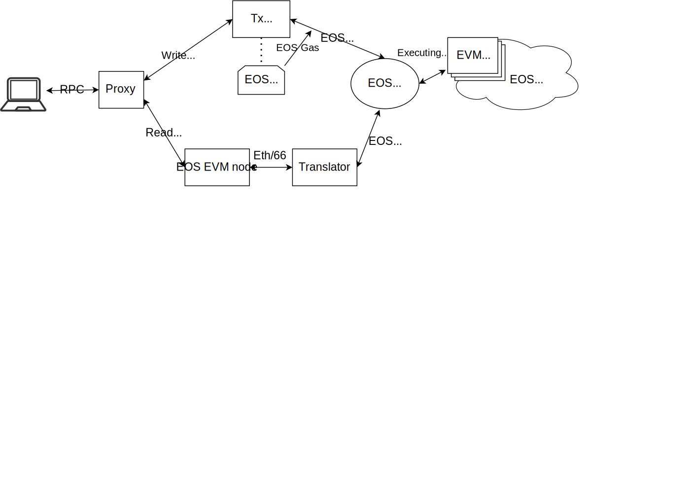

The EOS EVM implements a smart contract which runs on the EOS network, we shall call it form this point forward the `EVM Contract`. To send transactions to the EOS EVM network one has to send transactions to the EVM Contract. The EOS EVM Contract is fully compatible with the Ethereum EVM except for some small differences which can be consulted in the [EVM Compatibility](../30_compatibility/10_evm-compatibility.md) section.

To achieve the complete RPC compatibility, a full functioning Ethereum node is utilized. The EOS EVM testnet and mainnet use an Ethereum node built on top of Silkworm node, we shall call it from this point forward the `EOS EVM Node`.

All the RPC requests, reads and writes, sent by the EOS EVM clients, are first processed by a proxy component, which redirects the requests as follows:

- the reads to the EOS EVM RPC component, and
- the writes to the Transaction Wrapper service.

### The Read Requests

The JSON-RPC read requests are supported by the EOS EVM RPC component which is a fork of [SilkRPC](https://github.com/torquem-ch/silkrpc) and implemented as a daemon that supports nearly all of the Ethereum JSON-RPC for the virtual EVM blockchain managed by the EOS EVM Contract. Two of the RPC methods, `eth_sendRawTransaction` and `eth_gasPrice` are intentionally disabled because it is not appropriate for this daemon to handle them. Instead requests for the two methods are routed to the  Transaction Wrapper service which is designed specifically to support those two RPC methods.

The EOS EVM RPC component relies on the database managed by an execution client for (virtual) EVM blockchain. The execution client is the EOS EVM Node component, which is a fork of [Silkworm](https://github.com/torquem-ch/silkworm) modified to work with the changes to the EVM runtime that are needed to support the EOS EVM, e.g. the trustless bridge.

The EOS EVM Node needs to reproduce exactly the EVM transaction execution that was first done by the EOS EVM Contract. It needs to reconstruct the virtual EVM blockchain that is managed by the EOS EVM Contract using data extracted from the EOS blockchain. To facilitate this, EOS EVM Node connects to a state history plugin (SHiP) endpoint of an EOS node which is part of the EOS blockchain.

This architecture makes possible to expose the Ethereum client Web3 JSON RPC APIs and potentially other APIs if necessary.

### The Write Requests

As mentioned earlier, the two RPC methods, `eth_sendRawTransaction` and `eth_gasPrice`, are not implemented by EOS EVM RPC. Instead they are implemented by the `Transaction Wrapper` (in the below diagram `Tx Wrapper`) component. Therefore, all the *write requests* are forwarded to the Transaction Wrapper, which packs them into EOS actions and sends them to the EVM Contract.

The primary purpose of the Transaction Wrapper is to take raw EVM transactions via `eth_sendRawTransaction` and push them to the EOS EVM Contract. 
It accomplishes this through the following steps:

1. Constructs an EOS transaction which contains the `pushtx` action of the EOS EVM Contract which includes the rlp-encoded EVM transaction.
2. Sings the EOS transaction with the key of an EOS account that acts as the miner of the `pushtx` action and pays the CPU/NET costs of the EOS transaction.
3. Sends the signed EOS transaction to the EOS blockchain via the chain API of an EOS node connected to the EOS network.

Transaction Wrapper also supports the `eth_gasPrice` RPC method, despite the fact that it is a read method, because its implementation also depends on access to the chain API of an EOS node. In particular, it simply grabs the minimum gas price configured in the EOS EVM Contract from the appropriate table and returns it to the caller.

This architecture allows the possibility for other implementations of Ethereum nodes to be used if it is deemed necessary for some specific scenarios.
